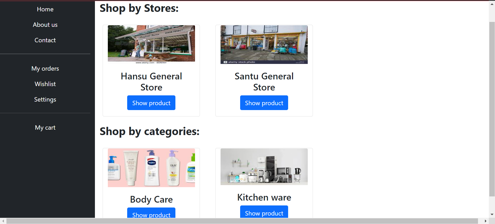

# e-Available
## Description
It's an online shopping web application like Flipkart and Amazone.This application is created with the help of "Django" framework which is completely based on python language and for good css i have used "Bootstrap".

## Framework
- Django
- Bootstap

## Modules with their screenshots:
- Home Page
This is very first page when you visit my web app, where various categories will be appear to find your products. 

- Product page
After opening any category you will switch to this page where all the product of respective category will be appear.

- Product detail page
In this page you can see the detail of any specific product on which you will click from previous page.

- Cart page
Now this is your cart where you can see the total ammount of your products you have selected to buy.And you can change the quantity of your products.

- Checkout page
Now in this page you have to enter your details to place your order.

